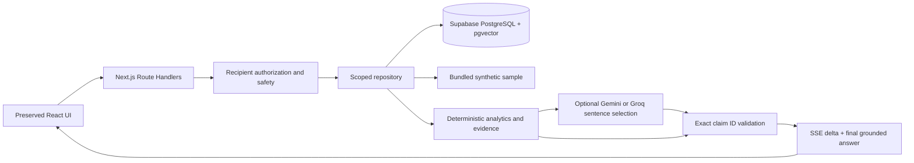

# Architecture

`src/lib/server/` holds analytics, sample generation, ingestion, retrieval, safety, intent parsing, Gemini transport, signed context, and orchestration. `src/lib/supabase.ts` is server-only and lazily constructs stateless clients. Build-time rendering never requires credentials.

## API contract

- `GET /api/recipients`: the original `CareRecipient[]` interface.
- `POST /api/chat`: `{care_recipient_id|recipient_id, message, conversation_id?, reference_time?}`. The old `session_id` is accepted as an unused compatibility field; follow-up state travels in the signed conversation token.
- SSE: `status` heartbeats, `evidence` with verified records, `delta` with a text fragment, `done` with the full original `GroundedAnswer`, or sanitized `error`.
- Invalid input/authorization returns JSON with a proper HTTP status before streaming. An incomplete stream is a client error, never a successful answer.

## Database and source selection

`DATA_SOURCE=demo` uses only bundled synthetic records. `DATA_SOURCE=supabase` uses only Supabase; errors never silently fall back to a different dataset. Real server-role keys stay on the server. All record reads include recipient filters. Authorization restricts demo IDs or verifies a Supabase user and membership before retrieval.

The schema extends the requested core tables with baseline time windows, sample counts, metadata, explicit demo designation, authorization memberships, and two budget rows per provider. HNSW uses cosine distance on 1536-dimensional normalized Gemini vectors. RPCs run as invoker and are granted only to the service role. Tables have RLS and no browser grants.

Baseline records use deterministic IDs including the training window; seeding ignores duplicate baseline IDs so reruns preserve historical versions. A new training window creates a new version. New algorithms should use new versioned IDs rather than rewriting old baselines.

## Budget, context, and failure handling

The provider budget is an atomic database transaction with fixed minute/day rows per provider; no Redis or in-memory rate counter. Each embedding and generation reserves a call. Supabase is required for live cloud usage so limits persist across serverless instances. Seeding honors Gemini's budget. Groq generation has independent counters and does not require Gemini credentials. `LLMProvider` exposes `provider_name`, `model_name`, and `streamClaimIds`; the orchestrator selects implementations using `LLM_PROVIDER` and an explicit optional `LLM_FALLBACK_PROVIDER`.

The signed follow-up token contains recipient, activity/time intent and a one-hour expiry. It contains no transcript and does not grant recipient access. Production sessions derive their signing key from `SESSION_SECRET` or the service-role key. The public bundled demo has a non-secret fallback signing key and remains restricted to fixed synthetic profiles.

Provider failure returns exact deterministic claims. Database failure returns an error. Inputs, queries, evidence packaging, output tokens, provider timeouts, and the total request duration are bounded. Network cancellation propagates from the browser to upstream requests.

## Deliberate limits

Dates are resolved in UTC for the included UTC profiles. This sample does not implement arbitrary recipient-local timezone/DST scheduling, ingestion of live home sensors, clinical risk prediction, a login screen, longitudinal transcript storage, or all possible natural-language date phrases. The renderer still honors recipient timezone for evidence display. Ask explicit ISO dates for unsupported phrases.
