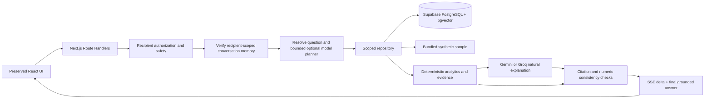

# Architecture

`src/lib/server/` holds analytics, sample generation, ingestion, retrieval, safety, question planning, Gemini/Groq transport, signed context, and orchestration. `src/lib/db.ts` lazily constructs a small direct PostgreSQL pool using `DATABASE_URL`. Build-time rendering never requires credentials.

## API contract

- `GET /api/recipients`: the original `CareRecipient[]` interface.
- `POST /api/chat`: `{care_recipient_id|recipient_id, message, conversation_id?, reference_time?}`. The old `session_id` is accepted as an unused compatibility field; follow-up state travels in the signed conversation token.
- SSE: `status` heartbeats, `evidence` with verified records, `delta` with a text fragment, `done` with the full original `GroundedAnswer`, or sanitized `error`.
- Invalid input/authorization returns JSON with a proper HTTP status before streaming. An incomplete stream is a client error, never a successful answer.

## Database and source selection

`DATA_SOURCE=demo` uses only bundled synthetic records. `DATA_SOURCE=database` uses only the direct PostgreSQL connection; errors never silently fall back to a different dataset. `DATABASE_URL` stays on the server. All record reads include recipient filters. Demo mode restricts reads to fixed sample IDs.

The schema extends the requested core tables with baseline time windows, sample counts, metadata, explicit demo designation, and two budget rows per provider. HNSW uses cosine distance on 1536-dimensional normalized Gemini vectors. Route handlers use parameterized SQL through the direct PostgreSQL pool; the browser never connects to the database.

Baseline records use deterministic IDs including the training window; seeding ignores duplicate baseline IDs so reruns preserve historical versions. A new training window creates a new version. New algorithms should use new versioned IDs rather than rewriting old baselines.

## Budget, context, and failure handling

The provider budget is an atomic database transaction with fixed minute/day rows per provider; no Redis or in-memory rate counter. Each planning, embedding and generation request reserves a call. Supabase is required for live cloud usage so limits persist across serverless instances. Groq has independent counters and does not require Gemini credentials. Provider configuration uses `LLM_PROVIDER`, model settings and an explicit optional `LLM_FALLBACK_PROVIDER`. Social turns cost no model calls; clear factual questions normally need one composition call.

The signed follow-up token contains recipient, resolved intent, the last three bounded question/answer excerpts, and a one-hour expiry. It is signed, not encrypted, and does not grant recipient access. Set a stable random `SESSION_SECRET` on every deployment; absent that, database mode uses the private connection string as signing material and bundled mode uses an ephemeral random key. Rotating either key invalidates prior tokens. Tokens are checked for size, expiry, tampering and recipient binding. This is short-term conversational memory, not durable cross-device history.

The workflow is safety → memory → intent planning → scoped retrieval → deterministic comparisons → LLM composition → validation → SSE delivery → memory update. Explicit daily overviews reset inherited activity filters. Named meals select only that meal. Referential questions reuse their earlier time and activity scope; duration explanations receive server-computed timestamp calculations. Ambiguous questions can invoke a five-second JSON planner restricted to allowed activities and periods. The model cannot choose recipient IDs or SQL. Overview retrieval combines daily routines with a separate matched recent behavioral window. Safety and social replies preserve the last valid evidence context. Read [response design](RESPONSE_DESIGN.md) for the researched communication principles and validation limits.

Provider failure returns exact deterministic claims. Database failure returns an error. Inputs, queries, evidence packaging, output tokens, provider timeouts, and the total request duration are bounded. Network cancellation propagates from the browser to upstream requests.

## Deliberate limits

Dates are resolved in UTC for the included UTC profiles. This sample does not implement arbitrary recipient-local timezone/DST scheduling, ingestion of live home sensors, clinical risk prediction, a login screen, longitudinal transcript storage, or all possible natural-language date phrases. The renderer still honors recipient timezone for evidence display. Ask explicit ISO dates for unsupported phrases.
